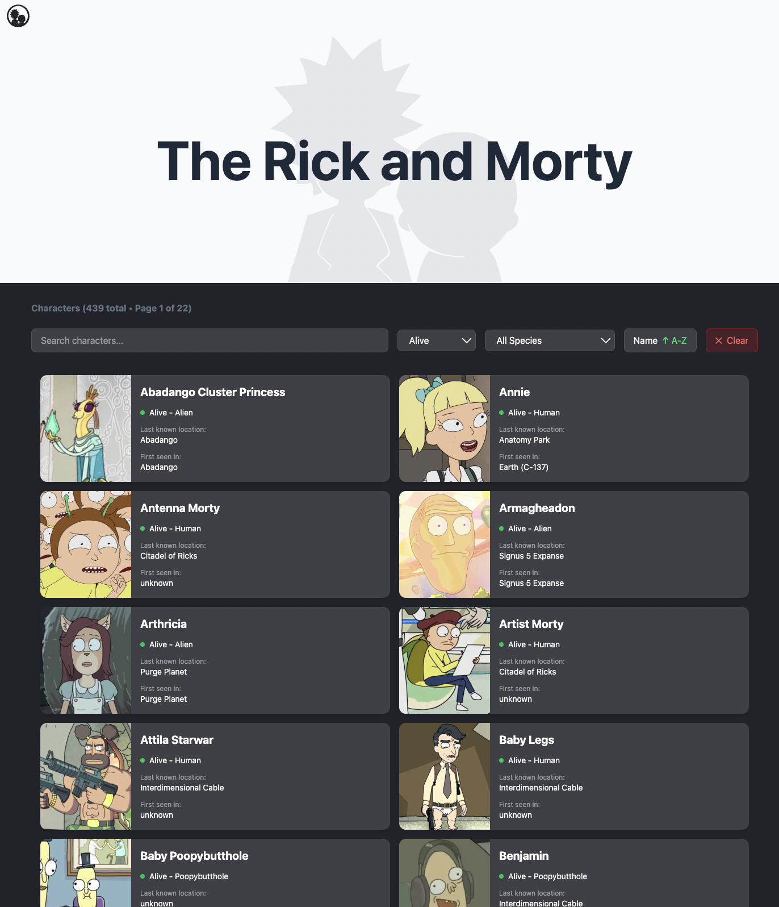

# The Rick and Morty App

## Explore the Multiverse

A character explorer app for fans of Rick and Morty — browse, search, and discover characters from across the multiverse.

## View the live version hosted on Vercel [Rick and Morty App](https://rick-morty-app-tau.vercel.app/) 🚀



## Features

Here are some of the current features that Rick and Morty App has:

- [x] Browse all characters from the Rick and Morty universe
- [x] Search characters by name
- [x] Filter by status (Alive, Dead, Unknown)
- [x] Filter by species (Human, Alien, Humanoid, Robot, and more)
- [x] Sort characters alphabetically (A-Z / Z-A)
- [x] Detailed character view with origin and location info
- [x] URL-based state management for shareable searches
- [x] Pagination with smart page navigation
- [x] Loading states and error handling
- [x] Responsive design (Tailwind CSS)
- [x] Client-side routing with React Router

## Tech Stack

Rick and Morty App is built using the following technologies:

- [React 19](https://react.dev/) - The library for web and native user interfaces
- [Vite](https://vite.dev/) - Next generation frontend tooling
- [TypeScript](https://www.typescriptlang.org/) - JavaScript with syntax for types
- [Tailwind CSS v4](https://tailwindcss.com/) - A utility-first CSS framework
- [React Router v7](https://reactrouter.com/) - Declarative routing for React
- [Rick and Morty API](https://rickandmortyapi.com/) - The Rick and Morty API

## <a name="quick-start">🤸 Quick Start</a>

### Prerequisites

- Node.js version 18 or higher
- npm or yarn package manager

### Installation

Clone the repository:

```bash
git clone https://github.com/your-username/rick-morty-app.git
cd rick-morty-app
```

Install the project dependencies using npm:

```bash
npm install
```

### Running the Project

Start the development server:

```bash
npm run dev
```

Open [http://localhost:5173](http://localhost:5173) in your browser to view the project.

## Project Structure

```
rick-morty-app/
├── src/
│   ├── api/           # API configuration and helpers
│   ├── components/    # Reusable UI components
│   ├── constants/     # Filter options and constants
│   ├── pages/         # Page components
│   ├── utils/         # Utility functions
│   ├── types.ts       # TypeScript type definitions
│   ├── App.tsx        # Main app component
│   └── main.tsx       # Entry point
├── public/            # Static assets
└── index.html         # HTML template
```

## License

This project is licensed under the MIT License - see the [LICENSE.md](LICENSE.md) file for details
